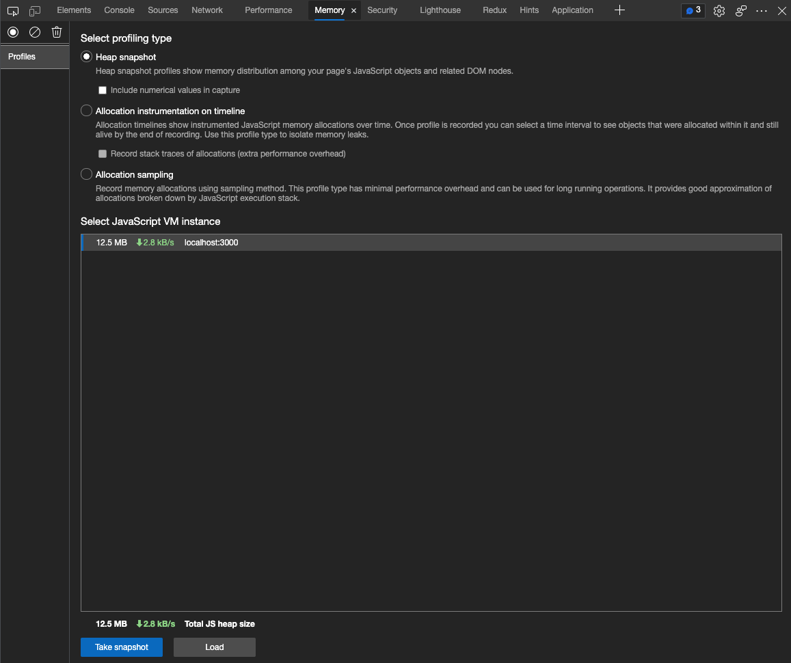
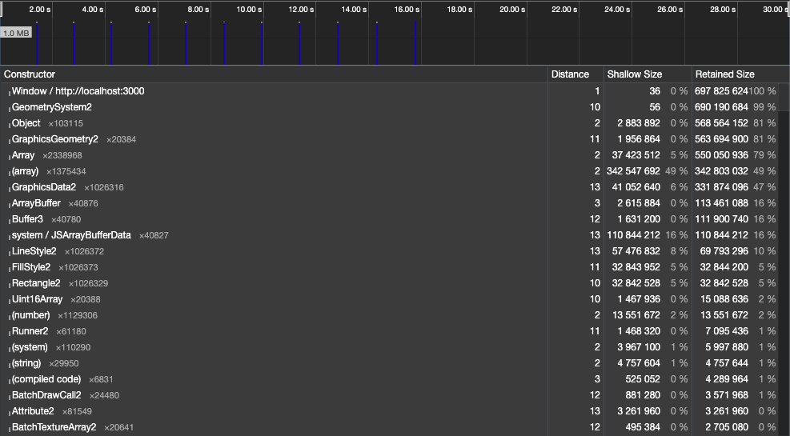
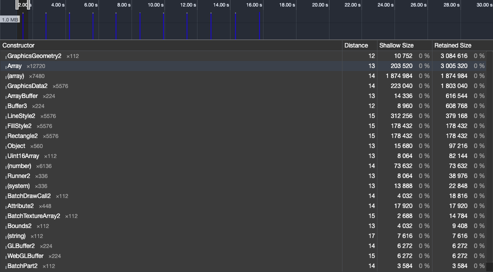
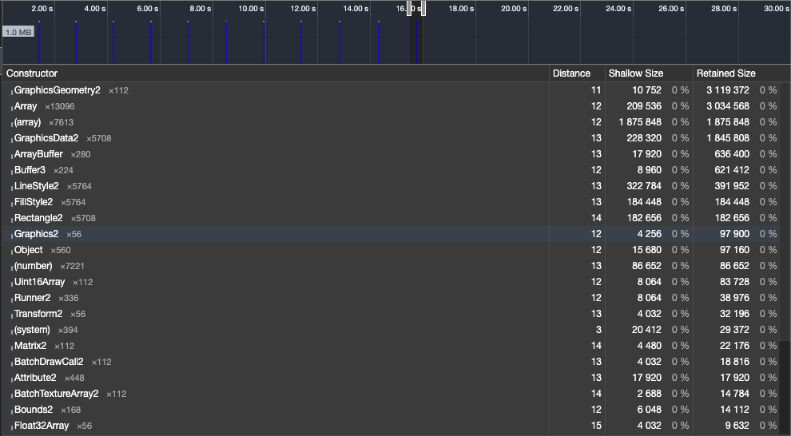

# Day13

目前做到這邊的大家應該會發現一些問題，
在上一個章節，雖然我們成功產生了很多敵人，但是程式卻發生了 `Memory Leak`。

這就是這個章節的主題，`程式優化`。
卡比將介紹如何找到真正的問題，並採取對應的優化方式。

## Profiling

首先，我們要打開 `DevTool`，並切到 `Memory` 頁籤。



這邊有三個選項，這次只會用到 `Allocation instrumentation on timeline`，他會做一個時間軸並記錄時間內的記憶體使用狀況。

按下 `Take Snapshot` 開始取樣。

首先下面這張是按下 `Snapshot` 時的狀態，



接著我們選時間軸，第一條藍色的時間段，對照一下。



發現到 `GraphicsGeometry2` 產生的物件數量非常多，

再對照一下，最後一條藍色的時間段。



也是一樣最多的是 `GraphicsGeometry2`，
我們基本可以確定問題出在 `Graphics`， `pixi.js` 的 `API`。

於是查詢 `pixi.js` 的 `文件`或是 `issue`，
我們最後會查到，原來 `pixi.js` 的 `Graphics`，
在建立時會順便產生一些 `Bonus`，而這些並不會自動被清除。

## Refector

找到問題後，我們就很清楚要修正 `src/systems/render.ts`，因為我們只有在那裡用到。
我們要修改成，只使用同一個 `Graphics` 並每次畫面更新前都要先清除上次的資料。

修正如下：

-- `src/systems/render.ts`

```ts
function Graphics(
  graphics: _Graphics,
  { renderer, position }: Renderer & Transform
) {
  const src = renderer.src;

  for (let y = 0; y < src.length; y++) {
    for (let x = 0; x < src[y].length; x++) {
      if (src[y][x] === 0) continue;

      graphics.beginFill(0xffffff);

      graphics.drawRect(position.x + x, position.y + y, 1, 1);

      graphics.endFill();
    }
  }
}

const graphics = new _Graphics();

export function clear() {
  graphics.clear();
}

export function render(stage: Container, instance: GameObject & Renderer) {
  stage.addChild(graphics);

  if (instance.renderer.type === "graphics" && canTransform(instance)) {
    Graphics(graphics, instance);
  }
}
```

接著，我們只需要在 `src/scenes/Game.ts`，那邊呼叫 `clear` 即可。

```diff
export default function Game(screen: Rectangle): Scene<Container> {
  let instances: GameObject[] = [LaserCannon(screen), ...spawn(Enemy, points)];

  return {
    update(delta) {
      collisionDetect(instances.filter(canCollision).filter(canTransform));

      instances.forEach((instance) => {
        if (canControl(instance)) {
          instance.handleInput(getKeyPressed());
        }

        if (canShoot(instance) && instance.canShoot) {
          requestAnimationFrame(() => {
            instances = [...instances, instance.shoot()];
          });

          instance.canShoot = false;
        }

        if (instance.destroy) {
          requestAnimationFrame(() => {
            instances = instances.filter((_instance) => _instance !== instance);
          });

          return;
        }

        instance.update?.(delta);
      });
    },

    render(stage) {
+     clear();

      instances
        .filter(canRender)
        .forEach((instance) => render(stage, instance));
    },
  };
}
```

這時我們再重新檢測 `memory`，這時的記憶體使用量會低非常多，就表示優化成功了。

#### 關於兔兔們：

- [Tailwind CSS 臺灣官網](https://tailwindcss.tw)
- [Tailwind CSS 臺灣](https://www.facebook.com/tailwindcss.tw) (臉書粉絲專頁)
- [兔兔教大本營](https://www.facebook.com/lalarabbits-%E5%85%94%E5%85%94%E6%95%99%E5%A4%A7%E6%9C%AC%E7%87%9F-102150975410839/)


